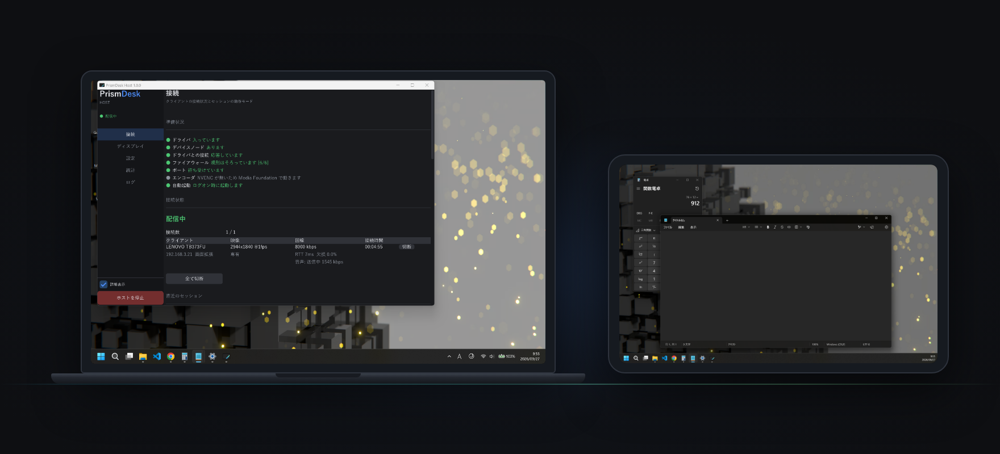
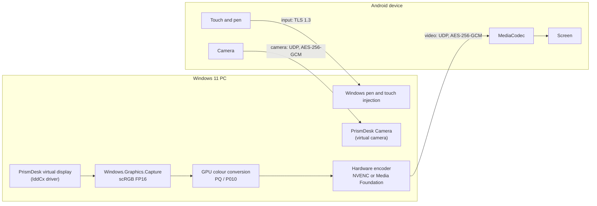

# PrismDesk

**The second monitor you already own.**

PrismDesk turns an Android tablet or phone into a wireless display for your
Windows PC — in HDR, with pen pressure, and with numbers you can check before you
trust it. It installs a real virtual display driver, so Windows sees a genuine
extra monitor with its own resolution, not a mirrored window you have to arrange
around.

Windows 11 · Android 8.0+ · one-time purchase, no subscription, no account ·
nothing leaves your network.

[Website](https://prismdesk.app) · [Documentation](docs/faq.md) ·
[Discussions](https://github.com/Asynchronous-0x4C/prismdesk-app/discussions) · [Report a bug](https://github.com/Asynchronous-0x4C/prismdesk-app/issues/new/choose)

---

## Not released yet

PrismDesk is not out yet. There is nothing to download here.

- **Get one email when it ships:** [https://prismdesk.app](https://prismdesk.app)
- The Android app is not on Google Play yet either — it goes up when the closed
  test finishes.

## Requirements

| | |
|---|---|
| **PC** | Windows 11 64-bit, build 22000 or later, with administrator rights. Windows 10 is not supported and the installer stops on it. |
| **Encoder** | A GPU that can encode H.264 in hardware — NVIDIA NVENC, or an Intel or AMD encoder through Media Foundation. |
| **Device** | Android 8.0 (API 26) or later with a hardware H.264 decoder. |
| **Network** | Both on the same LAN, wired or Wi-Fi. PrismDesk is not a way to reach your desktop from a café. |

Devices that have actually been tested are listed in
[docs/devices.md](docs/devices.md).

## How it works

1. **Install it on the PC.** One installer. It adds the display driver, the
   firewall rule and the start-up entry itself.
2. **Open the app on the device.** It finds the PC on your network by itself, or
   you scan the QR code the PC shows.
3. **Leave it alone.** Restart the PC and it is listening again without being
   asked.

## What else it does

| | |
|---|---|
| **Pen** | Pressure, tilt and rotation arrive as real Windows pen input, so pressure-sensitive apps see a pen and not a mouse. |
| **Webcam** | The device camera shows up on the PC as "PrismDesk Camera" for Discord, Teams or OBS. |
| **Four at once** | Four devices on one PC, sharing a single capture and a single encoder. Four is the number that was verified, so four is the number published. |
| **Encrypted** | TLS 1.3 on control and input; AES-256-GCM on video, audio and camera. The device pins the PC's certificate fingerprint. |
| **No account, no server** | No telemetry and **no automatic update check**. PrismDesk reaches the internet only while you are pressing a button — **Check for updates** (one small file; no version, nothing about your PC) or **Activate** (our payment provider). Press neither and it never leaves your own network. |

## Measured

| | |
|---|---|
| **5.0 Mbps** | Video at 2944×1840. spacedesk used 24.7 Mbps on the same content in the same test. |
| **8.9 kbps** | Idle, on a still screen. |
| **hdrSdrRatio 7.999703** | HDR end to end on a Pixel 9 — BT.2020 with a PQ curve, no silent fall back to SDR. |
| **12 of 12** | Sessions recovered after Wi-Fi was cut for 2, 5 and 10 seconds, four times each. |

**Test rig and method:** [https://prismdesk.app/#numbers](https://prismdesk.app/#numbers). Your numbers
will differ with your resolution, your content and your network.

## What it does not do — yet

- **No frame rate is advertised.** The rate follows what Windows composes: on a
  75 Hz primary display the achievable rates are 75, 37.5 and 25 — 60 is not on
  that list. Anyone promising you a number is promising you their monitor.
- **End-to-end latency is not published**, because it has not been measured in a
  way worth publishing. If you know how you would measure it, say so in
  [Discussions](https://github.com/Asynchronous-0x4C/prismdesk-app/discussions).
- **Long-run stability is not measured.** No multi-hour soak test has been run.
- **Windows 11 and Android only.** No macOS, no Linux, no iPad.
- **Closed source.** This repository holds the documentation, the issue tracker
  and the releases — not the product source.

Known problems live in [docs/known-issues.md](docs/known-issues.md).

## Documentation

| | |
|---|---|
| [Set up over Wi-Fi](docs/setup-wifi.md) | The normal path, and what to do when the PC is not found. |
| [Set up over USB](docs/setup-usb.md) | USB tethering, for when you would rather not use Wi-Fi. |
| [HDR](docs/hdr.md) | What has to be true on both ends, and how to tell whether you are getting it. |
| [Pen](docs/pen.md) | Pressure and tilt, and the Windows Ink settings that some apps need. |
| [Webcam](docs/webcam.md) | Using the device camera as "PrismDesk Camera". |
| [Devices](docs/devices.md) | What has been tested, and what people report. |
| [Known issues](docs/known-issues.md) | Current problems and workarounds. |
| [FAQ](docs/faq.md) | Licences, latency, frame rates, and the other recurring questions. |
| [SmartScreen](docs/smartscreen.md) | Why Windows warns about the installer. |

## Price

**US$22.** One-time purchase. No subscription, no account. The free edition covers the basics — one device, SDR, pen and touch input, and audio. Pro adds HDR, up to four devices at once, and your device camera as a Windows webcam. Pro is sold by Polar
Software, Inc. as merchant of record, and one key covers three of your own
Windows PCs. If it does not work on a PC that meets the requirements and it
cannot be fixed with you, there is a refund within 14 days — see
[https://prismdesk.app/refund](https://prismdesk.app/refund).

## Getting help

| | |
|---|---|
| **Questions, ideas, "does it work on X?"** | [Discussions](https://github.com/Asynchronous-0x4C/prismdesk-app/discussions) |
| **Bugs and device reports** | [Issues](https://github.com/Asynchronous-0x4C/prismdesk-app/issues/new/choose) |
| **A security problem** | [SECURITY.md](SECURITY.md) — by email, not in a public issue |
| **Anything with an order number, a licence key or personal data in it** | [support@prismdesk.app](mailto:support@prismdesk.app) — do not put those in a public issue |
| **Privacy** | [privacy@prismdesk.app](mailto:privacy@prismdesk.app) · [https://prismdesk.app/privacy](https://prismdesk.app/privacy) |

What is worth reporting, which template to use, and why there are no pull
requests: [CONTRIBUTING.md](CONTRIBUTING.md).

## Legal

- [Terms of use](https://prismdesk.app/terms) · [Privacy policy](https://prismdesk.app/privacy) ·
  [Refunds](https://prismdesk.app/refund)
- Third-party licences:
  [Windows host](THIRD_PARTY_NOTICES.txt) ·
  [Android app](THIRD_PARTY_NOTICES_ANDROID.txt)
- **This repository's text** — this README, everything under `docs/`, the issue
  templates and [CHANGELOG.md](CHANGELOG.md) — is licensed
  [CC BY 4.0](LICENSE): copy it, translate it, quote it, as long as you credit
  "PrismDesk documentation by async0x4c", link to https://prismdesk.app, and say if you
  changed anything. **The application itself is not published here** and is
  licensed separately ([terms of use](https://prismdesk.app/terms)); the PrismDesk name
  and logo are not covered. The two third-party notice files above keep each
  component's own licence.

PrismDesk is built by one person in Tokyo. Windows is a trademark of Microsoft
Corporation and Android is a trademark of Google LLC; PrismDesk is not
affiliated with either.
